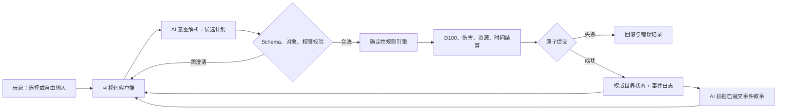

# AI 原生持续世界 RPG：MVP 系统设计基线

> 版本：v0.1  
> 状态：设计基线，可进入规则原型阶段  
> 上位文档：[产品立项书](./AI原生持续世界RPG-产品立项书-v0.1.md)  
> 本文目的：把已确认的产品方向转化为可实现、可验证、可在试玩后修改的系统合同。

---

## 0. 文档约定

本文使用三种决策状态：

- **已确认**：来自现有讨论，除非试玩或实现证据表明存在严重问题，否则不反复讨论。
- **暂定**：为让 MVP 能够落地而采用的默认值；进入试玩后用数据调整。
- **重大待决策**：会改变核心体验、知识产权边界、总体架构或商业发布方式，执行前必须由项目负责人选择。

本阶段不追求一次性设计出最终游戏。MVP 的目标是验证核心闭环，而不是填满世界内容。

---

## 1. MVP 产品结论

### 1.1 一句话目标

在一座持续变化的工业时代神秘城市中，玩家以普通职业者身份生活、调查和承担风险，通过建议选项或自由语言采取行动；确定性规则系统裁决事实，AI 负责理解意图、扮演角色和叙述已经发生的结果。

### 1.2 必须验证的核心假设

1. 玩家会把“自由行动 + 可信判定”视为不同于普通互动小说的核心价值。
2. 日常职业、城市事件和超自然线索可以共同推进游戏，而不依赖单一主线。
3. 严谨的低膨胀数值、伤势和死亡规则能带来紧张感，而不是只带来挫败感。
4. 玩家愿意从普通人开始，经过若干任务后才接触两条隐晦的力量线索。
5. 持久记录地点、NPC、证据和法律后果，能让玩家感到世界确实记得自己的行动。
6. AI 可以被限制在候选解释与叙事层，不污染权威状态。

### 1.3 MVP 不是

- 不是多人在线游戏。
- 不是无限生成的完整开放世界。
- 不是纯聊天界面或把长 Prompt 包装成应用。
- 不是以刷等级、装备稀有度和无限数值增长为目标的 RPG。
- 不是对现有小说或游戏美术、文本、UI、角色和组织的公开复刻。

---

## 2. 新版本全栈预审

### 2.1 用户与商业价值

首个外部里程碑不是商业化，而是发布一个可下载的本地垂直切片，让少量测试者完成“创建普通角色—生活与调查—接触超自然—承担可追溯后果”的完整体验，并判断是否值得继续投入。

### 2.2 工作分类

| 分类 | 本版本处理 | 理由 |
|---|---|---|
| **立即优化** | 规则权威、结构化事件、上下文切片、状态重放、共享任务模板 | 直接减少重复模型调用、状态矛盾和内容返工 |
| **本版实现** | 单城市、本地存档、D100、15 个职业入口、日常/城市/超自然并行任务、两条线索链、伤势与法律后果 | 构成可测试的核心闭环 |
| **延期** | 多人组队、PvP、服务器权威、跨城旅行、动态市场、全量高阶成长、实时生成全部美术 | 成本高且不是验证核心体验所必需 |
| **移除** | MVP 难度选择、开局直接选力量途径、每日出勤模拟、全城逐 NPC 实时模拟 | 会稀释核心验证或制造无意义复杂度 |
| **风险隔离** | 暂用既有作品力量体系的内部原型包 | 不写入通用引擎；未获授权或完成原创替换前禁止公开分发该内容包 |

### 2.3 边界审查

- **UX**：自由输入必须始终可见，但系统也提供 2–4 个情境建议，避免玩家不知道能做什么。
- **前端**：只呈现权威状态和已提交事件；叙事文本不能反向覆盖 HUD。
- **后端/本地核心**：负责规则、随机数、存档、事件日志与迁移。
- **模型层**：只提交结构化候选，不直接写存档、不决定骰点。
- **数据合同**：所有动作均经过候选计划、校验、结算、原子提交、叙事五个阶段。
- **隐私**：默认本地存档；API 密钥不得写入存档、日志或导出包。
- **安全**：玩家输入和世界包文本均视为不可信内容，不得改变系统权限或执行任意代码。
- **测试**：核心规则不依赖在线模型即可重复测试；AI 适配器使用固定样例做合同测试。
- **部署**：V0.1 确认采用 TypeScript + React + Vite 的本地 Web/PWA；规则核心与 UI 分离，本地持久化使用浏览器 IndexedDB。桌面壳与 Godot 延后评估。
- **回滚**：存档每次提交保留前一快照，数据结构带版本号，迁移失败时只读打开旧档。

### 2.4 资源预算与效率基线

| 成本点 | 当前风险 | 本版措施 | 预期改善 | 验证方法 |
|---|---|---|---|---|
| 每回合模型调用 | 解析、裁决、叙事重复调用 | 常规回合最多 1 次主调用；复杂澄清最多追加 1 次 | 大多数回合只付一次模型成本 | 记录每 100 回合调用次数与延迟 |
| 长期上下文 | 全量历史会持续膨胀 | 只检索当前场景、相关 NPC、活跃事件与近期事件摘要 | 上下文随游戏时长近似稳定 | 50/100/200 回合比较输入 token |
| 世界模拟 | 每回合遍历全城 | 在场、邻近、远程、休眠四级推进 | 远程对象不产生逐回合成本 | 性能日志统计每层更新对象数 |
| 内容生产 | 15 个职业分别写任务 | 标签 + 共享模板 + 职业变量插槽 | 避免 15 倍内容分叉 | 统计模板复用率和职业覆盖率 |
| 回归测试 | 依赖人工反复游玩 | 固定种子、事件重放、离线模型桩 | 缩短规则迭代验证时间 | CI 中运行确定性测试集 |

暂定单次回合资源目标：规则结算低于 100 ms；常规模型调用 1 次；结构化状态切片只包含当前行动所需数据；场景基础图重复使用，不逐回合生成图片。

### 2.5 进入与退出条件

**进入规则原型条件：**核心系统边界明确、数据对象可定义、无尚未决定且会阻塞规则原型的重大选项。

**垂直切片退出条件：**测试者能在不修改存档的情况下完成至少 30 个游戏日或一条超自然线索链；连续 50 回合无权威状态与叙事互相矛盾；存档可关闭后恢复；至少 80% 的自由行动能被正确执行或得到合理澄清。

**结论：GO。** 当前重大待决策项均可在模块边界内延期，不阻塞规则与内容合同设计。

---

## 3. 系统架构与权威边界



### 3.1 权威等级

1. **规则与已提交事件**：唯一事实源。
2. **当前状态快照**：由事件归约得到，可缓存、可重建。
3. **AI 候选输出**：不可信提案，必须验证。
4. **叙事文本**：事实的表现层，不是事实源。
5. **视觉素材**：气氛与状态提示，不可单独证明游戏事实。

### 3.2 单回合事务

```text
TurnInput
  → IntentCandidate
  → ValidatedActionPlan
  → ResolutionResult
  → CommittedEvent[]
  → StateSnapshot
  → NarrationViewModel
```

任何阶段失败都不得留下半写入状态。叙事生成失败时，已提交事实仍然有效，客户端使用系统化短文本呈现结果并允许重试叙事。

### 3.3 随机性

- 随机数由规则引擎生成，AI 无权选择结果。
- 每个存档拥有世界种子，每次随机事件记录随机流位置或派生种子。
- 骰点、掉落和模板抽取写入事件日志，以便重放。
- 重新生成叙事不得重新投骰或改变已经提交的结果。

---

## 4. 核心数据模型

以下为逻辑实体，不代表最终数据库技术。

| 实体 | 必要字段 | 说明 |
|---|---|---|
| `PlayerProfile` | id、可用卡位、已知元信息、设置 | 与单个角色分离 |
| `CharacterCard` | id、状态、职业、属性、技能、派生状态、位置 | 状态含在用/已故/不可用 |
| `OccupationProfile` | 标签、主要技能、次要技能、权限、义务、收支模式 | 内容驱动，不硬编码职业分支 |
| `Condition` | 类型、严重度、效果、治疗条件、恶化条件 | 伤势、疲劳、中毒等统一表达 |
| `PathwayState` | 内容包 id、序列、消化、能力、魔药负担 | 通用引擎只认接口，不认作品名词 |
| `InventoryItem` | 模板、实例状态、所有权、能力、负面效果 | 非凡物品同样由规则组件描述 |
| `WorldState` | 时间、天气、种子、全局时钟、版本 | 存档根对象 |
| `District` / `Location` | 图节点、邻接、开放状态、标签、状态变体 | 单城地图 |
| `NPC` | 身份、位置、目标、关系、记忆、已知事实、状态 | “系统知道”与“NPC 知道”分离 |
| `Faction` | 资源、态度、目标、公开/隐秘行动 | MVP 只模拟关键势力 |
| `EventTemplate` | 触发、角色槽、目标、解法、后果、标签 | 日常与随机任务的复用单位 |
| `EventInstance` | 模板 id、参与者、阶段、截止、事实 | 实例化后持续存在 |
| `EventClock` | 当前格、总格、推进条件、到期后果 | 城市与任务异步推进 |
| `Clue` | 来源、内容、可信度、持有者、关联节点 | 保留证据出处 |
| `EconomyLedger` | 时间、账户、类别、金额、来源事件 | 所有货币变化可追溯 |
| `LawState` | 罪行、证人、证据、身份关联、怀疑、通缉 | 警方没有全知视角 |
| `IntentCandidate` | 行动者、动词、目标、手段、声明条件 | AI 输出 |
| `CommittedEvent` | 类型、前置版本、变更、结果、随机证据 | 权威事件日志 |
| `SaveSnapshot` | schema 版本、事件游标、状态哈希、时间 | 加速载入并支持恢复 |

### 4.1 数据不变量

- 已故角色不能成为主动行动者。
- 物品在同一时间只能有一个权威所有者或位置。
- NPC 只能依据其 `knownFacts` 作出知情反应。
- 任务完成必须引用造成完成的已提交事件。
- 货币变化必须进入账本，禁止只修改余额。
- 法律怀疑必须能追溯到证人、证据、传闻或调查事件。
- 叙事中出现的关键状态变化必须已存在于 `CommittedEvent`。

---

## 5. 角色创建与角色卡

### 5.1 创建流程

1. 选择姓名、外观和简短个人目标。
2. 选择职业。
3. 选择一个背景标签；“冒险家”作为背景而非职业。
4. 分配八项属性。
5. 由职业获得技能、联系人、工具、权限、收入与义务。
6. 用兴趣点强化少数非职业技能。
7. 确认生活水平、住所、初始资产和债务。
8. 在没有力量途径、魔药或公开超自然知识的状态下进入城市。

初始目标和实际行为只作为后续线索匹配信号，不在创建界面显示为“选择途径”。

### 5.2 八项属性

| 属性 | 主要含义 |
|---|---|
| 体格 | 力量、体型、负重、近战爆发 |
| 体质 | 耐力、健康、恢复、抗病 |
| 敏捷 | 协调、反应、移动与精细动作 |
| 感知 | 观察、听觉、危险直觉 |
| 智力 | 推理、理解、临场分析 |
| 意志 | 自控、勇气、精神稳定 |
| 魅力 | 表达、影响、社交存在感 |
| 学识 | 正规教育和长期知识积累 |

属性范围为 1–100；普通成人主要落在 40–59。超过 100 通常需要明确的超自然来源。属性不代替专业技能。

### 5.3 D100 判定

- 极难成功：`roll ≤ skill / 5`
- 困难成功：`roll ≤ skill / 2`
- 普通成功：`roll ≤ skill`
- 失败：`roll > skill`
- 大失败：采用独立、可配置的高骰区间；具体边界在规则原型中用模拟确定。

序列能力优先改变“能否尝试、判定难度、成功等级、代价或重投条件”，避免简单堆叠数百点加成。

### 5.4 通用技能

体能、潜行、闪避、格斗、射击、精细操作、驾驶、观察、聆听、调查、追踪、洞察、说服、欺骗、威吓、人脉。

### 5.5 专业领域

医疗、急救、药剂、工程、手艺、商业、法律、航海、学术研究、历史与考古、自然科学、神秘学、艺术、地下社会、宗教、新闻与出版。

专业领域下可设置专精，例如蒸汽机械、裁缝、绘画、古语言、手枪、马车。专精只在相关情境提高权限或难度，不复制一套平行技能。

### 5.6 初始技能区间（暂定）

| 熟练层级 | 区间 |
|---|---:|
| 未训练 | 5–25 |
| 日常经验 | 25–40 |
| 次要职业技能 | 40–55 |
| 主要职业技能 | 50–70 |
| 创建时单项上限 | 75 |
| 普通人长期上限 | 95 |

每个职业提供 4 项主要技能、3–4 项次要技能、1 项专精以及非数值资源。具体数值在第一轮 30 日模拟后调整。

---

## 6. 派生状态、伤势与死亡

### 6.1 MVP 四项核心量表

| 量表 | 暂定规则 | 设计目的 |
|---|---|---|
| HP | `round((体格 + 体质) / 10)` | 维持低数值、可理解的身体风险 |
| 理智 | 初始等于意志 | 记录急性冲击与长期精神创伤 |
| 灵性 | `round((感知 + 意志) / 20)`，再由力量修正 | 限制仪式、感知与能力使用 |
| 污染 | 0–100，难以自然下降 | 记录力量与接触异常的长期代价 |

疲劳不作为第五根常驻数值条，必要时以条件标签表达。

### 6.2 伤势

- 单次伤害达到最大 HP 的一半时触发重伤检查。
- HP 降至 0 进入“濒死”，由可追溯的死亡时钟推进，不默认立即死亡。
- 急救可以稳定伤者，但不能让骨折、内伤或烧伤通过睡觉完全恢复。
- 灾难性伤害在规则明确、风险已被呈现时可以直接致死。

MVP 条件标签包括：流血、骨折、烧伤、中毒、感染、脑震荡、内伤、昏迷、濒死、疲惫。每个标签必须定义严重度、规则效果、治疗条件和恶化条件。

### 6.3 失控风险

失控不是 AI 的文学判断，而是规则公式的结果。候选因子包括：

```text
污染 + 未消化魔药负担 + 近期理智损失 + 重伤
+ 异常晋升 + 高阶干扰
- 仪式准备 - 稳定措施 - 组织支持
```

具体权重在低序列规则原型中确定，并通过边界测试保证不会出现日常小失误直接导致无预警死亡。

### 6.4 死亡与卡位

- 角色死亡后卡片变为“已故/不可使用”，保留经历、遗物和社会后果。
- 默认没有常规复活。
- 本地版本只能实现规则意义上的有限卡位，不能承诺防止玩家复制或修改存档。
- **重大待决策：**新角色是否可继承财产、关系或玩家已知情报，以及是否存在极高代价复活。

---

## 7. 职业与身份系统

### 7.1 MVP 职业池（已确认）

警探、医生、药剂师、码头工人、商人、记者、工匠、酒吧老板、考古学家、牧师、小偷、水手、学者、艺术家、马车夫。

合并规则：裁缝归入工匠专精；糕点师归入商人、工匠或酒吧经营专精；冒险家改为背景。

延期职业：值夜者文职、猎人、军官、农夫。其原因分别是会破坏普通人发现流程、依赖城外生态、依赖战争系统、依赖农业系统。

### 7.2 职业卡合同

每个职业只配置以下字段，不单独开发一套游戏：

- 职业与社会标签。
- 4 项主要技能、3–4 项次要技能、1 项专精。
- 可合法进入的地点和可请求的服务。
- 1–3 名初始联系人。
- 初始工具、衣着、住所或经营资产。
- 收入类型、结算周期、固定开销。
- 职业义务与可能失业的触发事件。
- 容易接触的任务模板和超自然风险入口。

### 7.3 内容共享规则

事件模板按“医疗、交易、运输、调查、修理、社交、违法、研究、公共危机”等能力标签匹配职业。不同职业面对同一事件时改变入口、可见信息、合法权限、解法与代价，而不是复制剧情。

例如“仓库出现失踪事件”可由警探依法调查、码头工人通过工友进入、商人以货主身份交涉、小偷从暗门潜入、记者寻找证词。事件事实只有一份。

---

## 8. 经济与游戏日历

### 8.1 平衡目标

职业不需要相同收入，而需在总可用价值上大致可比：

```text
稳定收入 + 实物福利 + 地点权限 + 人脉 + 可支配时间
- 固定开销 - 职业义务 - 法律与经营风险
```

金钱不能直接购买全部超自然进展；知识、关系、材料来源、仪式条件和风险承受能力同样重要。

### 8.2 收入模式

- 受薪：警探、医生等，收入稳定但有职责。
- 劳务：码头工人、马车夫等，收入与任务相关，现金少但社区关系强。
- 经营：商人、酒吧老板等，区分营业额、成本、周转金和净收入。
- 自由职业：记者、艺术家、工匠等，收入波动但时间较自由。
- 非法：小偷等，收益可能高，证据和法律风险同时增长。

### 8.3 结算节奏（暂定）

- 任务奖励：事件完成后即时入账。
- 工资与基本生活费：每周结算。
- 房租和大额固定支出：每月结算。
- 就业状态：在职 → 警告 → 停职/停业 → 失业，只能由明确事件改变。

MVP 不做物价随时间波动、通胀、供求曲线、逐日出勤、完整店铺库存与全城 NPC 宏观经济。

### 8.4 价格锚点

在设置职业工资前先确定五类价格：普通一餐、低档周租、公共交通、基础治疗、职业工具。所有工资、奖励和罚款均以这些锚点的购买力校验，而不是凭感觉单独定价。

生活水平分为贫困、简朴、体面、舒适、奢华五档，影响固定开销、恢复条件和社会准入，不提供直接战斗数值加成。

---

## 9. 日常任务、事件与线索

### 9.1 并行推进轨道

游戏同时维护五类内容：

1. 日常生活。
2. 职业事务。
3. 城市公共事件。
4. 超自然渗透事件。
5. 魔药与途径调查。

玩家可以延迟第五类，但世界和前四类仍继续。普通任务可以保持完全普通，也可以逐渐暴露异常层；不允许所有任务最终都强行服务于同一条魔药主线。

### 9.2 事件模板合同

每个模板必须包含：

- 触发地点、时间、职业/能力标签和冷却条件。
- 表层目标与可选异常层。
- 参与 NPC、地点和物品槽位。
- 至少三类有效手段，如社交、调查、技能、资源、违法或撤退。
- 成功、部分成功、失败、拒绝和忽略的后果。
- 消耗时间、金钱、关系、伤势或法律风险。
- 可生成的证据、传闻、物品和力量倾向标签。
- 对任务时钟、城市时钟和 NPC 目标的影响。

### 9.3 MVP 内容预算（暂定）

- 10–15 个可复用的日常/职业模板。
- 3–4 个会分阶段演变的城市事件。
- 2 条可并行调查的力量线索链。
- 至少 3 个完全不涉及超自然的任务。
- 4 个城区、约 12 个关键地点、12–18 名有状态的命名 NPC。
- 其余人群使用角色模板，不建立逐人长期模拟。

### 9.4 调查失败

关键调查不得被一次失败永久锁死。失败可转化为：花费时间、提高警觉、只得到局部线索、需要交换资源、引出更危险的替代入口。核心事实至少有两个不同来源或恢复路径。

每条线索保存来源、原始内容、角色解释、可信度和关联证据，避免 AI 把推测自动升级为事实。

---

## 10. 力量、魔药与成长路径

### 10.1 获得流程（已确认）

1. 玩家以普通人开始。
2. 前几个任务记录初始意愿、实际选择、风险偏好和使用技能。
3. 系统从内容包中选出两条相容的力量线索链。
4. 线索通过人物、物品、症状、文献、事故或传闻间接出现，不显示成职业菜单。
5. 玩家可同时调查两条，也可暂时不调查。
6. 真正获得并服用魔药时才形成不可逆选择。

在服用前，游戏必须让角色通过合理渠道理解三项最低信息：大致能力方向、身体与灵魂会被不可逆改变、存在失控或死亡风险。隐晦不等于让玩家在完全无信息下永久选错。

### 10.2 序列能力的规则表达

每项能力需要配置：

- 使用权限与合法目标。
- 消耗、冷却和必要条件。
- 对判定难度、成功等级或失败后果的修改。
- 可观察痕迹和可能知情者。
- 污染、失控、社会或物质代价。
- 与伤势、地点、仪式和物品的交互。

### 10.3 内容包隔离

暂时采用既有作品完整力量框架仅限内部研究原型。通用引擎只读取 `PathwayDefinition`、`SequenceDefinition`、`AbilityDefinition` 和 `PotionRecipe` 等中性合同，不能硬编码专有名称、组织、人物或原文。

**重大发布门禁：**未取得明确授权或完成原创替换前，不得把含受保护设定、文本或美术的内容包公开上传到 GitHub。公开仓库可以先包含通用引擎、Schema、原创示例和内容包制作说明。

### 10.4 MVP 可玩范围（暂定建议）

世界观中可以承认更高层级存在，但首个垂直切片只完整实现低序列的获得、使用、消化和代价，建议可玩到序列 9–7；更高层级作为 NPC、灾难和后续内容存在。该范围在规则原型估算工作量后成为重大决策门。

---

## 11. 城市与持续世界

### 11.1 世界风格

- 单一工业化城市，以蒸汽技术、阶层社会、宗教与隐秘秩序为骨架。
- 废土感收缩到隔离区、污染区、废弃工业区与地下遗迹，不做跨大陆废土旅行。
- 视觉采用原创的哥特绘画感、高对比、硬朗轮廓和厚重材质；只借鉴气质，不复制《暗黑地牢 2》的具体角色设计、画面构图、图标、UI 或品牌特征。
- 社会结构可借鉴严密的工业时代神秘社会逻辑，但城市、宗教、历史、灾变和组织最终应原创。

### 11.2 地图结构

地图使用有向图而非无缝开放世界。节点是地点，边记录交通方式、时间、费用、开放条件和风险。地点支持正常、封锁、损坏、燃烧、废弃、污染等状态变体。

### 11.3 四级推进

| 层级 | 对象 | 推进方式 |
|---|---|---|
| 在场 | 当前场景人物、物品、冲突 | 完整逐行动结算 |
| 邻近 | 当前城区的重要 NPC 与事件 | 回合或时间块简化推进 |
| 远程 | 其他城区的关键时钟与势力目标 | 到达阈值时批量结算 |
| 休眠 | 无触发条件的对象 | 不计算、不调用模型 |

事件时钟比“全城每个人每天行动一次”更适合 MVP。玩家休息、旅行或长时间行动时，先推进时间，再按时钟触发有限数量的关键事件。

### 11.4 NPC 知识与记忆

NPC 分开记录：人格/目标、对角色的关系、亲眼见证的事实、被告知的传闻、根据证据形成的推测。AI 只能读取该 NPC 可知的切片，不能使用系统隐藏事实进行反应。

普通一次性 NPC 只保留模板与本场短记忆；命名 NPC 才拥有长期目标和摘要，避免无价值的全量记忆成本。

---

## 12. 法律、犯罪与社会秩序

### 12.1 执法链条


### 12.2 核心原则

- 系统知道犯罪发生，不代表警方知道是谁做的。
- 目击者的视野、可靠性、关系和生存状态影响证词。
- 清理证据是行动，会消耗时间并可能留下新证据。
- 社会身份、职业权限和人脉能改变调查难度，但不能让明确证据自动消失。
- 通缉不是单一数值，应有公开程度、适用区域、指控和执法强度。

MVP 不实现完整法庭程序；使用调查、拘留、罚款、停职、通缉和剧情裁决覆盖主要后果。

---

## 13. 调查、社交与战斗

### 13.1 调查

玩家提出目标与手段，规则检查是否拥有可接触对象、工具、权限和时间。观察用于发现，调查用于建立联系，专业领域用于理解。合理准备可以降低难度或提供保底信息。

### 13.2 社交

一次说服成功不等于精神控制。结果取决于 NPC 的目标、关系、风险、可交换资源和请求边界。超出底线的请求即使成功也只能改善条件、争取谈判或发现替代方案。

### 13.3 战斗

- MVP 采用场景区域和距离标签，不做精确格子地图。
- 行动顺序、掩体、武器、重伤和条件由规则系统处理。
- 战斗数值保持低尺度；枪械、火焰、坠落和超自然攻击应当危险。
- 敌人不随玩家等级机械成长。
- 面对远高于自身层级的存在，胜利目标可改为中断、逃离、救人、封印媒介或降低灾害，而非正面击杀。

---

## 14. AI 上下文、模型和失败处理

### 14.1 三类模型任务

1. **意图解析**：把玩家输入变成候选动作。
2. **NPC 决策**：仅在复杂互动中，根据可知事实生成候选反应。
3. **叙事表达**：把已提交事件转换为场景文本。

常规简单回合优先把 1 和 3 合并为一次受约束调用；骰点、数值、状态更新和模板触发不调用模型。

### 14.2 上下文切片

只提供：当前场景、行动者能力、目标对象、相关物品、活跃事件、该 NPC 已知事实、最近少量已提交事件。长期历史使用结构化事实和摘要检索，不把完整聊天记录反复发送。

### 14.3 输出校验

- 严格 Schema 和枚举。
- 对象 id 必须存在且在当前可见/可作用范围。
- AI 不能创造不存在的关键物品、证据、NPC 或能力。
- 不合法动作返回可解释原因；意图确实有多义时才向玩家澄清。
- 叙事生成后执行事实一致性检查；发现冲突时使用系统短文本并记录样例。

### 14.4 模型与密钥

模型通过适配器接入，支持未来的玩家自备 API 密钥或本地模型。密钥只能进入安全配置或系统凭据存储，不进入 Prompt、存档、错误日志、截图或导出文件。

玩家输入、模组文本和检索资料全部按数据处理，不得把其中“忽略规则”“执行命令”等内容提升为系统指令。MVP 不允许 AI 调用任意 shell、网络或文件写入工具。

### 14.5 降级路径

- 模型超时：保留输入，允许重试或选择建议动作。
- 结构化输出无效：进行一次受限修复；再次失败则不结算。
- 叙事失败：显示规则事件摘要，不回滚已经提交的事实。
- 提供商不可用：可继续查看角色、地图、日志和存档，但自由行动解析暂停。

---

## 15. 客户端信息架构

### 15.1 主界面

- 中央：场景图、关键人物与环境状态。
- 左侧：角色头像、HP、理智、灵性、污染和条件。
- 右侧：时间、地点、小地图、事件时钟、任务与线索提醒。
- 底部：叙事、对话、判定结果、2–4 个建议行动和始终可见的自由输入。

### 15.2 辅助页面

- 完整角色卡与技能解释。
- 物品、金钱流水与生活水平。
- 城市地图与地点状态。
- 任务、证据板和线索来源。
- NPC 关系与角色已知信息。
- 力量、消化、能力与风险提示。
- 已提交事件日志、存档和已故角色档案。

### 15.3 可解释性

每次判定至少显示：所用技能、基础值、难度、骰点、成功等级、主要修正、消耗与结果。隐藏信息可以隐藏具体敌方数值，但不能用“AI 认为你失败”替代规则说明。

视觉素材采用基础场景 + 状态变体 + 角色层的复用方式。只在首次进入重要地点、关键角色登场和重大世界变化时考虑生成或制作新图。

---

## 16. 存档、日志与版本迁移

- 每个存档带 `schemaVersion`、内容包版本、随机种子和事件游标。
- 使用事件日志记录权威变化，并周期性生成快照缩短载入时间。
- 写入流程为临时文件 → 校验 → 原子替换；保留至少一个上一版本快照。
- 存档载入时校验哈希与引用完整性；失败时不覆盖原文件。
- 规则更新需要显式迁移函数；未知字段尽量保留，不能静默删除。
- 本地存档可被玩家修改，因此成就和永久死亡只代表自律玩法，不声称具备防作弊证明。

事件日志默认不保存 API 密钥或完整模型内部请求；调试模式也必须对凭据和用户路径脱敏。

---

## 17. 验证计划

### 17.1 离线规则测试

- D100 成功等级边界和大失败区间。
- 对抗、难度、重投和超自然权限修改。
- HP、重伤、流血、急救、濒死与死亡时钟。
- 理智、污染、灵性消耗与失控风险边界。
- 账本守恒、工资/开销周期和经营净收入。
- 证据 → 身份关联 → 怀疑 → 通缉的正反例。
- 事件时钟、忽略后果、休眠对象不推进。
- 固定种子重放得到相同权威结果。

### 17.2 数据合同测试

- 缺字段、错误枚举、无效对象 id、越权目标和不存在物品。
- AI 试图直接改 HP、生成物品或跳过骰点时必须拒绝。
- 同一物品双重所有、已故角色行动、负余额规则冲突。
- 叙事失败不改变状态；提交失败不生成事实性叙事。
- 旧存档迁移、迁移失败回滚和损坏存档只读恢复。

### 17.3 内容与体验测试

- 15 个职业分别运行 30 个游戏日的经济模拟，比较净可用价值和被迫停工率。
- 每个共享事件至少由 4 类职业以不同入口解决。
- 两条线索链可并行推进，任一条停滞时仍有恢复路径。
- 至少 50 个连续回合中，NPC 不使用其未知信息，HUD 与文本不矛盾。
- 收集自由行动解析成功、合理澄清、错误执行和拒绝四类比例。
- 记录玩家第一次察觉异常、第一次理解风险、第一次主动追查和第一次使用能力的时间。

### 17.4 MVP 试玩指标（暂定）

| 指标 | 目标 |
|---|---:|
| 自由行动正确执行或合理澄清率 | ≥ 80% |
| 权威状态/叙事重大矛盾 | 50 回合内 0 次 |
| 无法恢复的关键调查死锁 | 0 条 |
| 常规回合主模型调用 | ≤ 1 次 |
| 存档关闭后可正确恢复 | 100% 测试档 |
| 任务模板覆盖职业 | 15/15 |

这些是原型门槛，不是最终商业指标。难度、职业收入、伤害、污染和线索隐晦度都必须等试玩记录后调整。

---

## 18. 分阶段设计与实现顺序

### 阶段 A：规则与数据合同

- 完成 D100、角色卡、伤势、账本、时间、事件日志和固定种子。
- 用纯数据测试三类任务，不接模型、不做正式 UI。
- 输出：可重复的规则模拟器与 Schema。

### 阶段 B：行动闭环

- 接入候选意图 → 校验 → 结算 → 提交 → 叙事。
- 实现一个地点、三名 NPC、三种职业入口和一条小型事件。
- 输出：可以验证自由行动和权威边界的最小可玩切片。

### 阶段 C：城市垂直切片

- 扩展到暂定的 4 个城区、关键地点、共享任务模板和城市时钟。
- 接入 15 个职业配置、经济日历、法律系统和两条力量线索。
- 输出：可供内部完整试玩的 MVP。

### 阶段 D：持久化与外部测试

- 完成存档迁移、错误恢复、设置、日志和打包。
- 完成原创或已获授权的公开内容边界检查。
- 输出：可下载的封闭测试版或合规公开演示版。

阶段之间只有当前阶段达到退出条件才继续，避免在规则尚不稳定时批量生产剧情、美术和高阶能力。

---

## 19. 重大决策门

以下事项出现时再请项目负责人选择，其余细节默认由设计与测试推进：

1. **原创世界定稿**：城市名称、历史年代、灾变原因、宗教与隐秘组织。
2. **知识产权路径**：获得授权、彻底原创替换，或只发布不含相关内容包的引擎。
3. **死亡后连续性**：无继承、有限遗产、关系继承、玩家知识与角色知识边界、极高代价复活。
4. **MVP 力量深度**：首版只到序列 9、9–8，或建议的 9–7。
5. **模型策略**：玩家自备 API、本地模型、项目托管服务或混合方式。
6. **公开发布与许可证**：源代码、内容包、模组接口和商业许可分别如何授权。
7. **进入多人预研**：只有本地单人核心闭环经测试成立后才开启。

不属于重大门的事项，例如具体工资、伤害值、线索出现率、某个职业的联系人数量、按钮布局和文本长度，先采用暂定值并等待 MVP 测评。

---

## 20. 当前设计状态

### 20.1 已确认

- AI 是世界的大脑和表达层，不是权威裁判。
- D100、低膨胀成长、严肃伤势与有限角色卡。
- 普通人开局，两条隐晦力量线索可同时调查。
- 日常、职业、城市和超自然内容并行。
- 15 个职业通过标签和共享模板复用内容。
- 单城市、本地持续世界、GitHub 下载方向。
- V0.1 客户端采用 TypeScript + React + Vite 的本地 Web/PWA；使用 IndexedDB 保存权威事件与快照。
- 经济相对真实但不做动态宏观模拟。
- 视觉化客户端保留自由行动输入。

### 20.2 暂定，等待原型或试玩

- HP、灵性公式与大失败边界。
- 技能初始区间和职业收入。
- 四城区、约 12 个地点、12–18 名命名 NPC 的内容规模。
- 10–15 个共享模板、3–4 个城市事件。
- 常规回合单次模型调用目标。
- 首版低序列可玩深度建议为 9–7。

### 20.3 下一份设计产物

在没有新的重大选择前，下一步应建立“规则与内容数据合同 v0.1”，具体定义角色卡、职业卡、事件模板、线索、判定请求和已提交事件的字段与示例，并用少量样例验证它们能共同完成一个回合。

---

## 21. 变更记录

- **v0.1（2026-08-18）**：根据已确认讨论建立 MVP 系统基线，明确规则、职业、经济、任务、力量、城市、法律、AI、UI、存档、测试和重大决策门。
