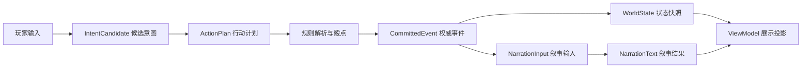

# Mistweave of Fates（灰雾织命）：V0.1 规则与内容数据合同

> 版本：v0.1  
> 状态：可供规则原型实现的设计稿  
> 关联文档：[MVP 系统设计基线](./Mistweave-of-Fates-MVP系统设计-v0.1.md)  
> 目标：把角色、世界、内容模板、玩家行动和权威事件定义成互相兼容的接口。
> 注意：本文是 V0.1 目标合同，不是当前实现或 MVP 达成证明；MVP 与 V1.0 公测仍以四个首发职业为当前合同范围，15 个职业已恢复为 V2.0 正式上线最低目标，但不在本合同中提前实现，成熟度见[版本定义与发布门](./docs/版本定义与发布门.md)。

---

## 0. 使用方式与决策状态

本文不是最终数据库结构，也不是某一种编程语言的类定义，而是跨客户端、规则引擎、内容编辑器和 AI 适配器的最小数据协议。

- **权威数据**：由规则引擎创建或提交，能改变游戏事实。
- **候选数据**：由 AI、UI 或内容工具提出，必须经过校验。
- **展示数据**：由权威数据生成，不能反向修改状态。
- **暂定字段**：为让原型运行而存在，试玩后可以删改，但迁移必须显式处理。

所有顶层对象都必须带 schemaVersion。不兼容变更升级主版本；新增可选字段升级次版本；文字、数值和内容调整升级内容包版本。

---

## 1. V0.1 数据流



### 1.1 四条不可违反的边界

1. IntentCandidate 不能直接写入 WorldState。
2. ActionPlan 只声明要做什么，不包含骰点结果或最终伤害。
3. CommittedEvent 是唯一能改变权威事实的输出。
4. NarrationText 即使失败，也不能改变已经提交的事实。

### 1.2 顶层响应包

```json
{
  "schemaVersion": "0.1.0",
  "requestId": "req_01H...",
  "worldId": "world_local_001",
  "characterId": "char_001",
  "eventCursorBefore": 128,
  "eventCursorAfter": 131,
  "status": "committed",
  "candidate": {},
  "committedEvents": [],
  "stateHash": "sha256:...",
  "viewModel": {},
  "narration": {}
}
```

状态枚举：awaiting_clarification、rejected、resolved_not_committed、committed、narration_degraded、system_error。

---

## 2. 标识、引用与版本

### 2.1 标识规则

- 静态内容使用稳定字符串 id，例如 occupation_detective、event_missing_crate。
- 运行时实例使用世界内唯一 id，例如 npc_004、event_i_0021。
- 事件日志使用递增游标和不可变 eventId。
- 玩家可见文本不作为引用键；改写文案不会改变事实关联。

### 2.2 时间格式

- 世界时间：worldDay、hour、minute。
- 事件持续时间使用分钟整数。
- 所有结算明确写出时间消耗；无时间消耗的行动也写 0。

### 2.3 引用完整性

引用对象不存在、属于另一个世界、已故、不可见或不在行动权限范围时，行动必须被拒绝或转为澄清，不得自动创建替代对象。

---

## 3. 内容包合同

内容包是可替换的世界、职业、事件、能力与文本集合。通用引擎只依赖中性接口。

### 3.1 内容包清单

```json
{
  "schemaVersion": "0.1.0",
  "contentPackId": "city_demo_original",
  "contentVersion": "0.1.0",
  "title": "城市演示包",
  "license": "local-test-only",
  "engineCompatibility": ">=0.1.0 <0.2.0",
  "localization": ["zh-CN"],
  "assets": {"sceneVariants": 4, "portraits": 8},
  "modules": ["city", "occupations", "events", "pathways_demo"],
  "publicRelease": false
}
```

受保护作品的名称、组织、角色、原文和美术不得写入公开内容包。内部研究包必须与通用引擎分离，并在清单中明确 publicRelease 为 false。

### 3.2 标签合同

标签是内容复用的主要连接方式，必须来自受控枚举或内容包声明的命名空间：

```json
{
  "tags": [
    "skill:investigation",
    "access:police_archive",
    "social:working_class",
    "risk:legal",
    "pathway:observation"
  ]
}
```

标签不能单独授予权限；权限必须在角色、地点、事件或规则表中显式引用。

---

## 4. 角色卡合同

### 4.1 角色卡

```json
{
  "schemaVersion": "0.1.0",
  "characterId": "char_001",
  "playerId": "player_local_001",
  "status": "active",
  "name": "伊莱亚斯·沃德",
  "occupationId": "occupation_reporter",
  "backgroundTags": ["curious", "debt_burdened"],
  "attributes": {
    "physique": 48,
    "constitution": 43,
    "agility": 55,
    "perception": 62,
    "intelligence": 58,
    "willpower": 51,
    "charisma": 47,
    "education": 64
  },
  "skills": {
    "observation": 58,
    "investigation": 62,
    "persuasion": 45,
    "stealth": 25,
    "news_publishing": 61
  },
  "specializations": ["street_interviews", "short_hand"],
  "derived": {
    "hp": {"current": 9, "max": 9},
    "sanity": {"current": 51, "max": 51},
    "spirituality": {"current": 5, "max": 5},
    "pollution": 0
  },
  "conditions": [],
  "inventoryIds": ["item_notebook_001", "item_camera_001"],
  "money": {"currency": "city_pound", "balance": 18.4},
  "lifestyleTier": "modest",
  "locationId": "loc_press_office",
  "relationshipIds": ["rel_char_npc_004"],
  "pathwayState": null,
  "lawStateId": "law_char_001",
  "creationSlot": 1,
  "createdAtWorldDay": 1
}
```

属性和技能使用英文稳定键，展示层负责本地化。这样可以避免中文文案改名后破坏存档。

### 4.2 角色状态不变量

- 非 active 状态的角色不能发起主动行动。
- 当前值不能超过最大值；污染是 0–100 的长期值。
- 角色不能拥有不存在的物品实例。
- 角色死亡必须通过 character_death 事件产生，不能直接改状态。
- 角色的途径能力必须存在于其 pathwayState 对应的内容包版本中。

### 4.3 玩家档案

```json
{
  "schemaVersion": "0.1.0",
  "playerId": "player_local_001",
  "characterSlotLimit": 3,
  "characterIds": ["char_001", "char_002"],
  "deceasedCharacterIds": ["char_000"],
  "playerMetaKnowledge": [],
  "settings": {"language": "zh-CN", "showRollDetails": true}
}
```

playerMetaKnowledge 只记录玩家层面的发现历史；新角色是否能在游戏内使用这些知识，由背景和事件规则决定。

---

## 5. 职业与经济合同

### 5.1 职业卡

```json
{
  "schemaVersion": "0.1.0",
  "occupationId": "occupation_reporter",
  "displayNameKey": "occupation.reporter.name",
  "primarySkills": ["investigation", "observation", "news_publishing", "persuasion"],
  "secondarySkills": ["insight", "streetwise", "sneak"],
  "specializationIds": ["street_interviews"],
  "accessTags": ["access_press_room", "access_public_records"],
  "contactTemplateIds": ["contact_editor", "contact_printer"],
  "startingAssetTemplateIds": ["asset_notebook", "asset_camera"],
  "incomeModel": "freelance",
  "payCycle": "weekly",
  "basePay": {"min": 7, "max": 20, "currency": "city_pound"},
  "fixedExpenses": [{"ledgerKey": "lodging_modest", "amount": 4, "cycle": "weekly"}],
  "obligationTags": ["deadline_story"],
  "eventTags": ["investigation", "public_information", "rumor_network"]
}
```

工资和价格只是演示值；MVP 先验证四个首发职业，V2.0 正式数值必须经过届时 15 个可玩职业的长局模拟与专项平衡验收。

### 5.2 账本条目

```json
{
  "ledgerEntryId": "ledger_00081",
  "characterId": "char_001",
  "worldTime": {"worldDay": 8, "hour": 8, "minute": 0},
  "category": "income",
  "subCategory": "freelance_pay",
  "amount": 11,
  "currency": "city_pound",
  "sourceEventId": "evt_weekly_pay_008",
  "descriptionKey": "economy.freelance_pay"
}
```

余额是账本归约结果，不接受“直接设置余额”的 AI 或 UI 请求。经营职业必须至少记录收入、成本和净额三类条目。

---

## 6. 世界状态合同

### 6.1 世界根对象

```json
{
  "schemaVersion": "0.1.0",
  "worldId": "world_local_001",
  "contentPackId": "city_demo_original",
  "contentVersion": "0.1.0",
  "worldSeed": "seed_red_mist_001",
  "eventCursor": 131,
  "worldTime": {"worldDay": 8, "hour": 8, "minute": 12},
  "weatherId": "overcast_fog",
  "districtStates": {},
  "locationStates": {},
  "npcStates": {},
  "factionStates": {},
  "eventInstances": {},
  "eventClocks": {},
  "clues": {},
  "lawStates": {},
  "globalFlags": {},
  "stateHash": "sha256:..."
}
```

### 6.2 地点状态

```json
{
  "locationId": "loc_riverside_warehouse",
  "districtId": "district_river",
  "stateVariant": "guarded",
  "openHours": [{"from": 6, "to": 22}],
  "accessRules": ["tag:worker", "tag:business_owner", "permission:invitation"],
  "travelMinutesFrom": {"loc_press_office": 18},
  "visibleNpcIds": ["npc_foreman_002"],
  "activeEventIds": ["event_i_missing_crate"],
  "publicFacts": ["fact_recent_shipments_delayed"]
}
```

### 6.3 NPC 状态

```json
{
  "npcId": "npc_foreman_002",
  "templateId": "npc_dock_foreman",
  "locationId": "loc_riverside_warehouse",
  "status": "alert",
  "goals": [{"id": "goal_protect_reputation", "priority": 80}],
  "relationshipToCharacters": {"char_001": {"trust": 12, "fear": 0, "debt": 0}},
  "knownFacts": ["fact_crate_missing", "fact_char_001_asked_questions"],
  "rumors": ["rumor_night_whistle"],
  "activeConditions": [],
  "memorySummary": "最近三天有人询问仓库失踪货物，工头担心停工调查。"
}
```

系统隐藏事实、NPC 已知事实和 NPC 推测必须分别存储。叙事上下文只能向 NPC 决策提供后两者。

---

## 7. 事件模板与事件实例

### 7.1 事件模板

```json
{
  "schemaVersion": "0.1.0",
  "eventTemplateId": "event_missing_crate",
  "category": "occupation",
  "titleKey": "event.missing_crate.title",
  "trigger": {
    "locationTags": ["industrial", "warehouse"],
    "occupationTags": ["investigation", "transport", "trade"],
    "minWorldDay": 2,
    "cooldownDays": 5
  },
  "slots": {
    "location": "loc_riverside_warehouse",
    "npc": "npc_foreman_002",
    "missingObject": "item_sealed_crate_001"
  },
  "surfaceObjectiveKey": "event.missing_crate.surface_objective",
  "abnormalLayer": {
    "enabled": true,
    "revealConditions": ["clue:unusual_residue", "skill:occult_knowledge>=35"]
  },
  "validApproaches": [
    {"approachId": "ask_workers", "tags": ["social", "relationship"]},
    {"approachId": "inspect_records", "tags": ["investigation", "access"]},
    {"approachId": "sneak_inside", "tags": ["stealth", "legal_risk"]},
    {"approachId": "follow_tracks", "tags": ["tracking", "time_cost"]}
  ],
  "outcomes": {
    "success": ["clue:shipment_route", "clock:warehouse_investigation:-1"],
    "partial": ["clue:incomplete_witness_statement", "npc:foreman_alert:+10"],
    "failure": ["time:+60", "law:unauthorized_entry:+1"],
    "ignore": ["clock:warehouse_investigation:+1", "world:warehouse_state=sealed"]
  },
  "tags": ["investigation", "trade", "industrial", "possible_supernatural"]
}
```

### 7.2 事件实例

```json
{
  "eventInstanceId": "event_i_missing_crate",
  "templateId": "event_missing_crate",
  "state": "active",
  "createdAtEventCursor": 120,
  "deadline": {"worldDay": 10, "hour": 18},
  "participants": ["char_001", "npc_foreman_002"],
  "clueIds": ["clue_crate_whistle_001"],
  "clockId": "clock_missing_crate",
  "resolvedByEventId": null
}
```

### 7.3 事件不变量

- 事件实例只能由模板实例化，不能由 AI 临时发明关键事实。
- success、partial、failure、ignore 都必须有可执行后果。
- 忽略事件不等于删除事件；它推进时钟或改变世界状态。
- 已解决事件保留 resolvedByEventId，用于回顾和条件检查。

---

## 8. 线索与调查合同

```json
{
  "clueId": "clue_crate_whistle_001",
  "sourceType": "witness",
  "sourceId": "npc_dock_worker_007",
  "eventOriginId": "event_i_missing_crate",
  "contentKey": "clue.crate_whistle.description",
  "rawObservation": "证人听到午夜后有三短一长的口哨声。",
  "reliability": "uncertain",
  "interpretations": [
    {"id": "interpretation_signal", "status": "hypothesis"},
    {"id": "interpretation_ship_code", "status": "hypothesis"}
  ],
  "linkedFacts": [],
  "heldByCharacterIds": ["char_001"],
  "publicity": "private"
}
```

线索字段区分“观察到什么”和“角色认为这意味着什么”。AI 可以生成解释候选，但只有规则或内容作者定义的条件才能把解释升级为 confirmedFact。

调查合同必须允许：直接发现、部分发现、交叉验证、错误解释、交换线索、线索遗失和重新获取。关键门槛至少有两个来源或一个备用恢复路径。

---

## 9. 第一部分小结

到此，内容包、角色卡、玩家档案、职业经济、世界状态、地点、NPC、事件实例和线索的基础合同已经固定。下面的行动、判定、事件提交和叙事合同都只引用这些对象，不另造一套状态。

---

## 10. 玩家行动合同

### 10.1 原始输入

```json
{
  "inputId": "input_00431",
  "characterId": "char_001",
  "worldEventCursor": 128,
  "mode": "free_text",
  "text": "我先假装只是采访工头，再观察他有没有避开某个词。"
}
```

### 10.2 AI 候选意图

```json
{
  "schemaVersion": "0.1.0",
  "intentId": "intent_00431",
  "inputId": "input_00431",
  "actorId": "char_001",
  "intentType": "social_probe",
  "targetIds": ["npc_foreman_002"],
  "locationId": "loc_riverside_warehouse",
  "declaredApproachTags": ["deception", "interview", "observation"],
  "requestedOutcome": "发现工头回避的主题",
  "claimedResources": [],
  "ambiguities": [],
  "confidence": 0.91
}
```

AI 不得在这个对象中写入 roll、success、damage、newItem 或 setState。它只能表达玩家试图做什么。

### 10.3 行动计划

```json
{
  "actionPlanId": "plan_00431",
  "intentId": "intent_00431",
  "actions": [
    {
      "actionId": "action_1",
      "kind": "social_check",
      "actorId": "char_001",
      "targetId": "npc_foreman_002",
      "skillId": "deception",
      "difficulty": "normal",
      "opposedBy": "npc_alertness",
      "costs": [{"type": "time", "minutes": 15}]
    },
    {
      "actionId": "action_2",
      "kind": "observation_check",
      "actorId": "char_001",
      "targetId": "npc_foreman_002",
      "skillId": "observation",
      "difficulty": "hard",
      "requires": "action_1.success_or_partial"
    }
  ],
  "requiresPlayerConfirmation": false
}
```

规则引擎可拒绝计划、拆分计划、要求确认危险行动，或把不可同时完成的动作转为顺序行动。计划不能越过地点、时间、物品和权限检查。

### 10.4 澄清响应

```json
{
  "status": "awaiting_clarification",
  "questionKey": "action.clarify.target_scope",
  "options": [
    {"id": "public_interview", "labelKey": "action.public_interview"},
    {"id": "private_conversation", "labelKey": "action.private_conversation"}
  ],
  "preservedIntentId": "intent_00431"
}
```

只有确实会改变风险、权限或目标的歧义才询问玩家；普通语言差异由解析器归一化。

---

## 11. 判定与结算合同

### 11.1 判定请求

```json
{
  "checkId": "check_00881",
  "actionId": "action_1",
  "system": "d100",
  "skillId": "deception",
  "baseValue": 38,
  "difficulty": "normal",
  "modifiers": [
    {"source": "occupation_reporter", "value": 0},
    {"source": "npc_already_alert", "value": -10}
  ],
  "effectiveValue": 28,
  "randomSeedRef": "world_local_001:random:882",
  "roll": 17,
  "tier": "success"
}
```

roll 只能由规则引擎写入。显示层可以隐藏敌方有效值，但事件日志保留完整判定证据。

### 11.2 结算结果

```json
{
  "resolutionId": "resolution_00881",
  "actionPlanId": "plan_00431",
  "checks": ["check_00881", "check_00882"],
  "outcome": "partial_success",
  "changes": [
    {"type": "time_advanced", "minutes": 15},
    {"type": "npc_alert_changed", "npcId": "npc_foreman_002", "delta": 5},
    {"type": "clue_created", "clueId": "clue_foreman_avoidance_002"}
  ],
  "rejectedChanges": [],
  "followUpActions": ["ask_about_night_shift", "review_witness_notes"]
}
```

所有变化在提交前仍是候选。提交时必须检查世界事件游标没有被其他本地操作改变；冲突时重新读取状态并重新计划，不能静默覆盖。

---

## 12. 已提交事件合同

```json
{
  "schemaVersion": "0.1.0",
  "eventId": "evt_000129",
  "eventCursor": 129,
  "eventType": "social_check_resolved",
  "worldId": "world_local_001",
  "actorId": "char_001",
  "sourceActionPlanId": "plan_00431",
  "worldTimeBefore": {"worldDay": 8, "hour": 8, "minute": 12},
  "worldTimeAfter": {"worldDay": 8, "hour": 8, "minute": 27},
  "randomEvidence": ["check_00881", "check_00882"],
  "factsAdded": ["fact_char_001_observed_foreman_avoidance"],
  "factsRemoved": [],
  "stateChanges": [
    {"path": "npcStates.npc_foreman_002.status", "from": "alert", "to": "guarded"},
    {"path": "clues.clue_foreman_avoidance_002", "from": null, "to": "created"}
  ],
  "publicConsequences": ["rumor:journalist_questioned_warehouse"],
  "privateConsequences": [],
  "stateHashAfter": "sha256:..."
}
```

### 12.1 事件日志原则

- 事件不可修改，只能追加补偿事件。
- 事件类型来自受控枚举或内容包命名空间。
- 每个状态变化提供旧值、新值或明确的增量。
- 事件必须能由固定种子和输入重放。
- 叙事生成只读取事件及其允许的状态切片。

### 12.2 补偿事件

发现规则错误时，不编辑旧事件。例如错误扣除 10 元，应追加 ledger_correction，引用原事件并说明原因。这样玩家、测试和开发者都能重建历史。

---

## 13. 力量内容合同

通用引擎使用以下接口承载暂时的力量体系，避免把特定 IP 写死在核心代码。

### 13.1 途径定义

```json
{
  "pathwayDefinitionId": "pathway_demo_observer",
  "contentPackId": "pathways_demo",
  "displayNameKey": "pathway.demo_observer.name",
  "sequenceIds": ["seq_9", "seq_8", "seq_7"],
  "compatibilityTags": ["curiosity", "perception", "analysis"],
  "advancementRules": ["recipe_required", "ritual_required", "digestion_required"],
  "risks": ["pollution", "loss_of_control", "attention"],
  "publicKnowledgeLevel": "rumor"
}
```

### 13.2 能力定义

```json
{
  "abilityDefinitionId": "ability_demo_sense_trace",
  "pathwayDefinitionId": "pathway_demo_observer",
  "sequenceId": "seq_9",
  "permission": {"canAttempt": true, "targets": ["person", "object", "scene"]},
  "resolutionMode": "modify_check",
  "costs": [{"type": "spirituality", "amount": 1}],
  "conditions": ["line_of_sight", "not_unconscious"],
  "modifiers": [{"checkTag": "observation", "value": 15}],
  "traces": ["sensory_discomfort", "witness_may_notice"],
  "failureConsequences": ["pollution:+1", "sanity:-1"]
}
```

能力不能直接给出线索 id；它只能改变发现条件、判定或代价。线索仍由事件和规则创建。

### 13.3 魔药/晋升定义

```json
{
  "advancementDefinitionId": "advance_demo_seq_9",
  "pathwayDefinitionId": "pathway_demo_observer",
  "fromSequence": null,
  "toSequence": "seq_9",
  "requiredItems": ["item_demo_potion_9"],
  "requiredConditions": ["ritual_site", "recipe_understood"],
  "irreversibleChanges": ["body_soul_adapted"],
  "riskProfile": {"pollution": 12, "lossOfControl": "formula"},
  "onSuccess": ["pathway:activate", "ability:grant:seq_9"],
  "onFailure": ["condition:loss_of_control", "character:death_possible"]
}
```

---

## 14. 法律与证据合同

```json
{
  "lawStateId": "law_char_001",
  "characterId": "char_001",
  "incidents": [
    {
      "incidentId": "incident_003",
      "crimeTag": "unauthorized_entry",
      "originEventId": "evt_000127",
      "witnessIds": ["npc_guard_003"],
      "evidenceIds": ["evidence_broken_lock_001"],
      "identityLink": "weak",
      "investigationProgress": 15,
      "status": "unresolved"
    }
  ],
  "publicSuspicion": 8,
  "wantedLevel": 0,
  "employmentConsequences": []
}
```

法律系统只能读取事件中产生的证人、痕迹和传播后果。规则引擎不得因为“知道玩家做了什么”就自动创建警方已知证据。

---

## 15. 叙事与界面投影合同

### 15.1 叙事输入

```json
{
  "narrationInputId": "narr_000129",
  "committedEventIds": ["evt_000129"],
  "sceneSlice": {
    "locationId": "loc_riverside_warehouse",
    "visibleCharacters": ["char_001", "npc_foreman_002"],
    "publicFacts": ["fact_recent_shipments_delayed"]
  },
  "actorSlice": {"name": "伊莱亚斯·沃德", "occupation": "记者", "conditions": []},
  "npcSlices": [{"npcId": "npc_foreman_002", "knownFacts": ["fact_crate_missing"]}],
  "resultSummary": {"outcome": "partial_success", "newClueIds": ["clue_foreman_avoidance_002"]},
  "styleProfile": "gothic_clear_zh"
}
```

### 15.2 叙事输出

```json
{
  "narrationId": "narration_000129",
  "status": "valid",
  "paragraphs": [
    {"text": "工头回答得很快，却在提到夜班时停了一瞬。"},
    {"text": "你没有得到完整答案，但确认这个停顿并非偶然。"}
  ],
  "referencedEventIds": ["evt_000129"],
  "suggestedActionIds": ["ask_about_night_shift", "review_witness_notes"],
  "newFactsClaimed": [],
  "consistencyWarnings": []
}
```

newFactsClaimed 在 V0.1 默认必须为空；重要事实只能由规则事件产生。叙事可以表现气味、语气、氛围和不确定的感受，但不能凭空宣布物品、死亡、罪行或能力已经发生。

### 15.3 ViewModel

```json
{
  "scene": {"locationId": "loc_riverside_warehouse", "stateVariant": "guarded"},
  "hud": {"hp": "9/9", "sanity": "51/51", "spirituality": "5/5", "pollution": 0},
  "time": {"day": 8, "label": "星期二 08:27"},
  "activeClues": ["clue_foreman_avoidance_002"],
  "activeEvents": ["event_i_missing_crate"],
  "lawSummary": {"publicSuspicion": 8, "wantedLevel": 0},
  "actions": ["ask_about_night_shift", "review_witness_notes"],
  "freeInputEnabled": true
}
```

显示格式可以变化，但不得显示未提交的候选变化。

---

## 16. 错误、拒绝与降级

| 错误码 | 触发 | 处理 |
|---|---|---|
| E_SCHEMA_INVALID | AI 输出字段或枚举不合法 | 受限修复一次，失败则拒绝 |
| E_REFERENCE_MISSING | 对象 id 不存在 | 返回澄清或拒绝，不自动创建 |
| E_ACCESS_DENIED | 地点、物品或身份权限不足 | 显示原因，寻找替代路径 |
| E_CHARACTER_INACTIVE | 已故或不可用角色行动 | 回到角色选择/墓碑界面 |
| E_STATE_CONFLICT | 游标已变化 | 重新读取并重新计划，不覆盖事件 |
| E_RULE_VIOLATION | 试图跳过资源、骰点或前置条件 | 不结算，记录安全日志 |
| E_SAVE_INTEGRITY | 快照哈希或引用损坏 | 使用上一快照只读恢复 |
| E_MODEL_TIMEOUT | 模型未按时返回 | 保留输入，使用建议动作或重试 |
| E_NARRATION_INVALID | 叙事与事件冲突 | 使用系统摘要，不回滚状态 |

错误消息要告诉玩家“发生了什么、能做什么”，但不泄露隐藏敌对信息或系统密钥。

---

## 17. 一个完整回合的最小样例

1. 玩家输入：“我装作采访，观察工头是否回避夜班。”
2. AI 产生 IntentCandidate：目标为工头，手段为欺骗 + 观察。
3. 校验发现角色在仓库、拥有记者权限、工头可见，计划通过。
4. 规则引擎生成两个 D100 判定，记录固定随机引用。
5. 第一个普通成功，第二个困难成功，结算为部分成功。
6. 原子提交三个事件：时间前进 15 分钟、工头警觉度变化、创建一条不确定线索。
7. 世界快照更新，事件游标从 128 变为 131。
8. AI 只看到已提交的结果和工头已知事实，生成两段叙事与两个建议动作。
9. 客户端更新 HUD、线索板、事件时钟和日志。
10. 若第 8 步失败，客户端仍显示“部分成功、获得不完整线索、时间消耗 15 分钟”。

---

## 18. V0.1 验收规则

### 18.1 结构验收

- 所有顶层对象带版本号和稳定 id。
- 角色、地点、NPC、事件和线索可互相引用且能通过完整性检查。
- 公开内容包能在不依赖内部受保护内容的情况下加载。
- 旧版本新增字段不会破坏读取；破坏性变更会被拒绝并提示迁移。

### 18.2 权威性验收

- AI 无法直接修改 HP、余额、污染、物品、事件状态或法律状态。
- 固定种子下同一输入产生相同判定和状态变化。
- 叙事失败、超时或重试不重复扣费、不重复投骰、不重复创建物品。
- 任一关键状态都能追溯到一条或多条已提交事件。

### 18.3 内容验收

- 一个事件模板至少支持三种不同手段和四种后果分支。
- 四个首发职业中每个职业至少能改变三个事件的入口或解法。
- 两条线索链可以并行，玩家延迟超自然调查仍可完成普通任务。
- 线索的观察、解释和确认状态不会混为一谈。

### 18.4 性能与成本验收

- 规则结算不调用模型。
- 常规回合最多一次主模型调用；澄清或复杂 NPC 决策才追加调用。
- 叙事上下文不包含完整历史聊天记录。
- 休眠对象不触发模型调用或逐回合模拟。

---

## 19. 下一阶段输入

V0.1 数据合同通过内部审阅后，下一阶段不是马上生产全部内容，而是制作[三个最小样例](./Mistweave-of-Fates-V0.1最小内容样例.md)：

1. 一个完全日常的职业任务。
2. 一个带法律后果的调查任务。
3. 一个出现隐晦超自然线索、但不要求玩家立即获得力量的任务。

三个样例共用同一套角色、NPC、账本、线索、事件和叙事接口。若它们无法在不增加例外字段的情况下运行，说明合同仍未稳定。

---

## 20. 变更记录

- **v0.1（2026-08-18）**：建立内容包、角色卡、职业经济、世界状态、事件、线索、行动、判定、提交事件、力量、法律、叙事投影和错误处理合同。
- **v0.1（2026-08-19）**：补充合同到三个试玩样例与验收发布记录的追溯链接；字段合同不变。
