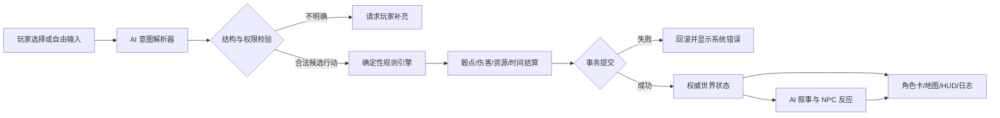

# Mistweave of Fates（灰雾织命）产品立项书

> 后续系统细化已记录于：[MVP 系统设计基线 v0.1](./Mistweave-of-Fates-MVP系统设计-v0.1.md)。该文件是目标设计而非完成证明；当前成熟度与发布门以[版本定义与发布门](./docs/版本定义与发布门.md)及较新的已确认规格为准。本文件继续作为产品愿景与立项依据。

> 文档版本：v0.1  
> 文档状态：V0.1、V0.2 均已验收发布
> 更新时间：2026-08-19
> 项目名称：Mistweave of Fates（灰雾织命）  
> V0.1 发布记录：[验收与发布记录](./Mistweave-of-Fates-V0.1验收与发布记录.md)；V0.2：[验收与发布记录](./Mistweave-of-Fates-V0.2验收与发布记录.md)。
> 当前结论：**V0.2 已作为“首次晋升规则系统验证版”发布：机械流程、自动化验收、浏览器复核和 Pages 部署成立，但日常调查反馈、主动材料获取、事件内能力价值及完整失败/恢复路径尚未形成，因此当前未达到 MVP，也未进入 V1.0 开发门。**

## 0. 文档使用说明

本文用于统一目前已经形成的产品共识，并作为后续讨论游戏整体框架的基线。它不是最终需求规格，也不代表所有问题都已经决定。

文中采用以下状态标记：

- **已确认**：来自当前讨论、可以作为后续设计前提的方向。
- **当前建议**：根据目标与现实约束提出的首选方案，需要后续验证。
- **待决策**：会显著改变玩法或技术架构，暂不应擅自定案的问题。
- **首版不做**：并非永久放弃，而是为了让第一个可玩版本成立而主动延后。

---

## 1. 项目摘要

本项目拟开发一款以本地运行和单人持续世界为首发形态的 AI 原生角色扮演游戏。游戏受到 COC/TRPG 跑团、开放式文字冒险和持续世界模拟的启发，但不以“玩家和聊天机器人轮流写小说”为最终形态。

游戏由确定性规则系统维护人物数值、骰点结果、伤害、死亡、物品、时间、地点、任务和世界状态；AI 负责理解玩家用自然语言表达的自由行动、扮演 NPC、组织叙事，并将已经确定的系统结果演绎成具有沉浸感的场景。

玩家使用有限的角色卡进入一个具有危险超自然力量的世界。角色可以成长为足以对抗部分超自然威胁的强者，但成长存在明确上限，强大能力伴随理智、身体、污染、关系、身份乃至永久死亡等代价。角色死亡后，其角色卡原则上进入不可用状态，死亡会成为持续世界历史的一部分。

长期愿景是让所有玩家进入同一个持续变化的世界，可以合作、竞争甚至敌对，并受到社会秩序和执法系统约束。考虑到服务器、内容治理、作弊、成本和平台合规要求，首个公开版本调整为 GitHub 分发的本地单人游戏；共享世界与多人交互只保留为远期架构方向。

---

## 2. 项目背景与机会

### 2.1 灵感来源

项目主要受到三类体验启发：

1. **AI 文字游戏**：玩家可以输入预设选项之外的自由行动，AI 能理解传统游戏无法穷举的行为。
2. **COC/TRPG 跑团**：角色卡、技能百分比、理智、调查、危险判定和高死亡风险，为长期数值稳定提供了成熟的设计启发。
3. **持续世界 RPG**：玩家行为不只改变一段对话，而会永久改变地点、NPC、势力、法律状态和后续事件。

### 2.2 现有产品的共同缺口

目前的 AI 角色扮演产品通常偏向两端：

- 一端是“聊天或续写工具”，自由度高，但规则、状态和长期记忆不可靠。
- 另一端是“传统规则游戏”，数值可靠，但玩家只能执行开发者预先设计的有限动作。

本项目的机会在于组合两者：让玩家拥有自然语言级别的行动自由，同时让世界事实、胜负和死亡不由 AI 临时改写。

### 2.3 GitHub 调研结论

目前没有发现一个开源项目完整覆盖“严谨百分骰规则、AI 自由行动、可视化客户端、长期世界状态、角色卡永久死亡和未来共享世界”这一组合。

值得持续参考的项目包括：

- [AI Sandbox Game](https://github.com/hayowei/aisandboxgame)：本地优先、世界卡、NPC 状态、存档、地图和 D20 判定，产品形态最接近。
- [open-tabletop-gm](https://github.com/Bobby-Gray/open-tabletop-gm)：用 Python 处理骰点、战斗和状态，LLM 负责叙事，责任边界最接近本项目。
- [Waidrin](https://github.com/p-e-w/waidrin)：使用强类型、可验证状态机和结构化叙事事件。
- [Talemate](https://github.com/vegu-ai/talemate)：长期记忆、NPC、时间与世界状态管理值得参考。
- [AI Town](https://github.com/a16z-infra/ai-town)：自治 NPC、可视化世界和未来多人模拟架构的参考。
- [SealDice](https://github.com/sealdice/sealdice-core)：中文 TRPG 骰点和 COC 相关判定生态的参考。

这些项目适合作为设计证据和局部参考，不建议在未完成许可证评估前直接拼接其代码。多个相近项目使用 AGPL 许可证，内置提示词和世界素材还可能采用不同许可。

---

## 3. 产品愿景、定位与边界

### 3.1 产品愿景

> 创造一个不围绕玩家临时编故事、而是能够记住行为、执行规则、承受后果并持续演化的 AI 世界。

### 3.2 一句话定位

> 一款由确定性规则引擎维护世界事实、由 AI 理解自由行动并演绎结果、采用高代价角色卡机制的持续世界调查 RPG。

### 3.3 核心产品原则

1. **AI 是世界的大脑，不是世界的法律。**
2. **规则系统决定事实，AI 只能解释和演绎事实。**
3. **自由行动不等于无条件成功。**任何合理行动都可以尝试，但必须接受能力、环境和概率约束。
4. **力量必须有边界与代价。**角色能够成长，但不能通过无限等级膨胀失去危险感。
5. **死亡和失败也是有效内容。**系统不应为了延续剧情而暗中保护玩家。
6. **世界具有连续性。**地点、NPC、势力、时间和公共秩序必须记住玩家造成的变化。
7. **首版优先完成一个可信的小世界，而不是生成一个空洞的大世界。**

### 3.4 产品不是什么

- 不是给超长 Prompt 套一层 UI 的聊天应用。
- 不是完全由 AI 即兴决定数值和规则的互动小说。
- 不是首发即支持上百玩家同时在线的 MMO。
- 不是直接使用《克苏鲁的呼唤》名称、官方规则文本或受保护世界观的非授权作品。
- 不是每个回合都等待 AI 重新生成全部画面的实时生成式影像游戏。

---

## 4. 目标用户与核心需求

### 4.1 首要用户

喜欢 COC、DND 或其他 TRPG，希望独自也能获得主持人、调查、判定和角色扮演体验的玩家。

核心需求：规则可信、行动自由、失败有意义、角色经历可长期保存。

### 4.2 次要用户

喜欢 AI 文字游戏、互动小说和角色扮演聊天，但对“模型忘记设定、数值漂移、强行圆剧情”感到不满的玩家。

核心需求：更具游戏感的界面、更稳定的世界状态、更清楚的后果反馈。

### 4.3 潜在扩展用户

喜欢沙盒模拟、经营或开放世界游戏，期待 NPC 拥有日程、记忆、关系和自主目标的玩家。

---

## 5. 核心玩家体验

玩家进入游戏后，应持续感受到以下四件事：

### 5.1 “我可以尝试自己想到的办法”

游戏提供少量建议行动，帮助玩家理解场景，但始终保留自由行动输入。玩家可以提出组合性行为，例如伪装醉酒、制造接触机会、观察袖口细节，而不必等待开发者提前制作相应按钮。

### 5.2 “系统真的进行了判定”

当行为存在不确定性时，系统明确展示使用了什么能力、难度如何、骰点结果是什么、产生了什么后果。AI 不得在骰点后偷偷改变成功与失败。

### 5.3 “这个世界记得我做过什么”

火灾后的建筑不会恢复原样；被欺骗的 NPC 会调整信任；违法行为会增加警方怀疑；势力受到损害后会采取后续行动。玩家离开某地时，NPC 和事件仍可以继续发展。

### 5.4 “力量越大，失去的东西可能越重要”

玩家可以获得对抗超自然存在的能力，但强行使用力量可能消耗理智、造成永久伤势、积累污染、暴露身份、伤害关系或导致角色死亡。

---

## 6. 核心玩法循环

### 6.1 标准回合

1. 游戏呈现场景、人物、环境线索和当前状态。
2. 玩家选择建议行动，或输入自由行动。
3. AI 将自然语言解析为结构化意图，但不直接修改游戏状态。
4. 规则引擎检查行动是否合法、需要哪些判定、可能影响哪些对象。
5. 必要时执行公开的概率判定、对抗判定、资源消耗或战斗结算。
6. 状态引擎以事务方式提交结果：成功、失败、伤害、时间、位置、物品、警觉度等。
7. AI 根据已经提交的结果生成叙事和 NPC 反应。
8. 客户端将数值、地图、关系和日志分别呈现，而不是把所有内容塞入文本框。
9. 世界推进，并生成下一轮可见情报与行动空间。

### 6.2 长期循环

> 调查与探索 → 获得线索或资源 → 承担风险 → 改变人物与世界关系 → 成长或受损 → 面对更深层威胁 → 选择继续、撤退、牺牲或更换角色

### 6.3 失败设计

失败不应只等于“什么也没发生”，而应根据情境产生不同形式：

- 花费更多时间，导致事件继续发展。
- 暴露意图，引起 NPC 警觉。
- 获得不完整或带偏差的线索。
- 损失资源、关系或社会身份。
- 受到身体、精神或污染伤害。
- 触发追捕、通缉、势力报复或角色死亡。

---

## 7. 角色卡、死亡与玩家身份

### 7.1 玩家与角色分离

**已确认：**“玩家”是持续存在的使用者身份，“角色卡”是玩家进入世界进行行动的具体角色。角色死亡不等于删除玩家，但会终止该角色的主动使用权。

建议将数据分为两层：

- **玩家档案**：已创建角色卡、已故角色、发现过的世界知识、设置和成就。
- **角色卡**：属性、技能、经历、关系、物品、伤势、理智、污染、法律状态和当前位置。

### 7.2 有限角色卡

**已确认方向：**玩家创建角色卡的机会应当有限，以确保死亡具有真实重量。

**关键约束：**在完全本地、可编辑存档的 GitHub 下载版中，系统无法真正防止玩家复制存档或修改角色卡次数。因此首版本只能提供“规则意义上的有限角色卡”和墓碑记录，而不能承诺防作弊的永久死亡。真正不可篡改的卡位与死亡状态需要未来由服务器作为权威事实源。

### 7.3 死亡规则

当前建议：

- 角色死亡后，角色卡状态改为“已故/不可使用”。
- 死亡现场、遗留物、未完成任务和社会关系继续存在于世界中。
- 已故角色保留完整档案，可供回顾，但不能直接重新载入继续游戏。
- 系统不默认提供复活。
- 游戏必须在致命风险前提供玩家能够理解的危险信号，但不保证玩家一定能逃脱。

### 7.4 待决策：死亡后的连续性

后续需要从以下机制中选择或组合：

- **无继承**：新角色从自身背景开始，只能通过世界正常渠道了解前任。
- **有限遗产**：允许继承少量合法财产、信件或公开情报，但不继承技能与超自然能力。
- **关系继承**：新角色可以是前任的亲属、同事或调查组织成员，从而合理继承部分任务关系。
- **世界档案继承**：玩家层面保留已解锁知识，但新角色是否知道这些内容仍由角色背景决定。
- **极高代价复活**：如果存在，应当是稀有剧情事件，而不是常规消耗品；必须带来不可逆后果。

---

## 8. 数值、成长与超自然力量

### 8.1 数值体系方向

**当前建议：**采用受 COC/BRP 启发、但由项目原创表达的百分比技能体系，而不是传统无限等级制。

- 行动成功率直观，玩家容易理解风险。
- 技能分别成长，不通过统一等级让全部属性同步膨胀。
- 高技能仍保留失败概率和环境限制。
- 人类尺度、超自然尺度和不可对抗尺度可以明确区分。

### 8.2 成长原则

- 经常或关键地使用某项技能，才获得相应成长机会。
- 成长速度随技能提高而逐渐减慢。
- 装备、人脉、知识和准备程度与数值成长同样重要。
- 角色可以成为专业调查者和有限的超自然强者，但不能仅靠刷数值变成无条件碾压世界的神明。
- 面对高阶存在时，胜利可以表现为阻止仪式、切断媒介、暂时封印、牺牲撤离或降低灾难规模，而不一定是正面击杀。

### 8.3 超自然力量的代价池

不同能力可以组合以下代价，避免所有力量都只消耗同一种“魔法值”：

- 即时理智或意志损失。
- 长期污染、人格变化或感知异常。
- 永久身体伤害、寿命损耗或器官负担。
- 必须使用稀缺材料、仪式条件或地点。
- 引起高阶存在、教团、警方或其他势力注意。
- 破坏与 NPC、组织或社会身份的关系。
- 能力失控并影响无辜者。
- 极端情况下导致角色永久死亡。

### 8.4 数值防崩坏原则

- 不设置无限增长的装备品质和等级阶梯。
- 同类加成不无限叠加，采用上限、衰减或互斥槽位。
- 强能力的限制来自条件和代价，而不只是更高数值。
- 世界威胁不应机械地跟随玩家等级同比膨胀。
- 规则公式、随机数种子和状态变更应可记录、复盘和测试。

---

## 9. 持续世界系统

### 9.1 首版世界形态

**已确认调整：**首版采用每位玩家各自拥有的本地持续世界。游戏可以从 GitHub 下载并在本地运行，存档由玩家自行保管。

### 9.2 世界需要持续记录的事实

- 游戏时间、日期、天气与重要倒计时。
- 地图、地点状态和环境变化。
- NPC 的身份、位置、健康、关系、记忆、目标和已知情报。
- 组织与势力的资源、态度、冲突和行动计划。
- 任务、线索、证据链和未解决事件。
- 玩家造成的公共影响、目击记录和传闻。
- 违法行为、警方怀疑、证据、通缉和惩罚状态。
- 角色死亡、遗物、墓碑和历史事件。

### 9.3 世界推进层级

为控制成本，世界不应在每回合模拟所有对象：

1. **在场层**：对当前场景中的角色和物体进行完整结算。
2. **邻近层**：对附近的重要 NPC、任务和倒计时进行简化推进。
3. **远程层**：只在时间节点、触发条件或玩家重新接近时进行批量结算。
4. **休眠层**：没有变化条件的对象不调用模型、不重复计算。

### 9.4 法律与秩序

玩家可以破坏秩序、攻击他人或与其他角色敌对，但世界必须做出符合证据和社会结构的反应。

建议将执法拆为：行为发生、目击与证据、身份关联、调查进度、怀疑等级、通缉状态和处罚结果。警方不应因为系统“知道”玩家犯罪就自动知道真相，也不应无视明确证据。

### 9.5 远期共享世界

长期愿景仍包括组队、交易、敌对、犯罪和共同影响世界。但这要求服务器权威状态、账户系统、反作弊、并发冲突处理、内容审核、社交安全和运营能力。

**首版不做：**实时多人、玩家 PvP、全局经济、跨玩家角色卡和服务器强制永久死亡。

---

## 10. AI、规则引擎与客户端的责任边界

### 10.1 确定性规则引擎

负责：

- 随机数与骰点。
- 属性、技能、难度和对抗关系。
- HP、理智、污染、伤势和死亡。
- 物品、货币、消耗和掉落。
- 时间、位置和地图合法性。
- 战斗顺序、伤害和状态效果。
- 任务状态、法律状态和世界事件条件。
- 状态提交、回滚、存档和重放。

这些结果一旦提交，AI 无权修改。

### 10.2 AI 世界模拟与叙事层

负责：

- 理解玩家自然语言中的目标、手段和隐含条件。
- 在规则允许范围内提出需要调用的判定。
- 扮演 NPC，并基于其记忆、性格、利益和情报作出反应。
- 将系统结果转化为清晰、符合氛围的叙事。
- 生成候选对话、事件、任务和世界扩展建议。
- 在信息不足时向玩家提问，而不是自行补造关键事实。

AI 的结构化输出必须经过 Schema、必填字段、枚举范围、对象存在性和权限校验，才能进入候选执行队列。

### 10.3 可视化客户端

负责：

- 场景、人物立绘或环境视觉。
- 角色卡、HP、理智、污染、伤势和资源。
- 地图、时间、天气、地点和任务提示。
- NPC 对话、建议行动和自由行动输入。
- 骰点动画、判定说明和后果反馈。
- 证据板、关系图、事件日志和存档管理。

### 10.4 推荐的数据提交原则

每次回合先产生一份“候选行动计划”，规则系统验证后生成“已提交事件”。叙事只能读取已提交事件。这可以避免出现文本已经描述敌人死亡，但权威状态中敌人仍然存活的矛盾。

---

## 11. 视觉与交互方向

### 11.1 基础界面布局

- **中央区域**：当前场景画面、关键人物和环境变化。
- **左侧或角色抽屉**：头像、身体、理智、污染、能力与即时状态。
- **右侧或信息抽屉**：时间、地点、地图、任务、线索和公共警觉度。
- **底部区域**：NPC 对话、系统判定、2-4 个建议行动和自由行动输入框。
- **辅助页面**：完整角色卡、物品、证据板、关系图、历史日志和已故角色档案。

### 11.2 视觉生成原则

- 不在每次行动后重新生成整张场景图。
- 地点使用可复用的基础画面和状态变体，例如正常、封锁、燃烧、烧毁。
- 生成式图像优先用于章节开场、首次发现重要地点、关键角色登场和重大世界变化。
- 骰点、状态和地图必须由传统 UI 即时反馈，不依赖图像模型。

### 11.3 V1.0 前 UI 资源策略

V0.2 现有的工业神秘风格、简洁布局和低操作负担作为 V1.0 前各迭代的默认视觉基线。V1.0 前不进行高成本美术采购、大规模视觉重制或仅为装饰增加复杂组件；UI 投入优先保证信息清楚、操作简便、响应式可用和核心流程可完成。V1.0 正式版发布后，再单独寻找美术资源并立项评估品牌视觉、原创资产和系统性 UI 升级，避免在玩法尚未稳定时产生重复设计与返工。

---

## 12. 内容与世界包

### 12.1 原创世界优先

正式产品应建立原创名称、势力、超自然体系、角色和剧情。COC、DND 和现有小说可以作为机制研究对象，但不能把受保护的文本、剧本、角色、怪物设定或美术直接作为商业内容。

### 12.2 世界包结构

底层引擎与内容分离。一个世界包建议包含：

- 世界概述和主题边界。
- 地图、地点和初始状态。
- NPC、势力、目标和关系。
- 可用角色背景和职业。
- 技能、物品、能力与代价配置。
- 事件、线索、谜题和结局条件。
- 叙事风格与视觉资产。

长期可以支持恐怖调查、修仙、末日生存、侦探、经营等不同世界包，但首版只验证一个原创恐怖调查世界。

---

## 13. 首个可玩版本建议

### 13.1 首版目标

制作一个可以由外部试玩者自行下载、配置模型并完成一段完整调查的垂直切片，证明以下核心假设：

1. 自由行动可以稳定转化为规则可执行的意图。
2. AI 不能绕过骰点、死亡和世界状态。
3. 玩家愿意为一个角色承担真实风险。
4. 可视化状态和场景比纯聊天显著提升游戏感。
5. 经过至少数十回合后，世界仍能保持基本连续性。

### 13.2 建议纳入

- 一个原创的小型恐怖调查区域。
- 单条正式调查链目标为 10–15 分钟或更短；V1.0 至少包含 10 条不同的公共调查链、四个首发职业各至少 3 条不同的职业专属调查链，以及每个实际开放的超凡序列/阶位至少 1 条不同的序列专属调查链。
- 职业链由同职业角色共享，不受其选择的序列影响；序列链由同序列角色共享，不受其职业影响。角色可访问公共池、当前职业池和当前序列池的并集，不为职业与序列的每种组合重复制作内容。
- 调查链采用受约束状态图与自由行动循环：作者定义事实、线索、时钟和合法终局，AI 负责理解候选意图与叙事，规则引擎负责判定、状态和结局收束；不穷举完整固定选项树。
- 用户提供的公开文字 RPG 样例证明，“建议选项 + 始终可用的自由输入 + 连续场景反馈 + 状态摘要”能够形成接近跑团的操作感；也证明模型若兼任规则引擎，会出现无判定成功、凭空线索、状态漂移、风险归零、重复提交和误读选择。因此本项目只复用交互模式，不复用样例的 IP 内容，也不把样例的模型自治方式作为实现方案。
- 一套原创百分比技能和 D100 判定规则。
- 一张完整角色卡，以及角色死亡后的不可用状态。
- HP、理智、污染、伤势和少量超自然代价。
- 5-8 个有明确目标和关系的重要 NPC。
- 4-6 个可发生持久变化的主要地点。
- 调查、社交、潜行和简化战斗。
- 建议行动与自由输入并存。
- 角色卡、地图、线索、骰点和事件日志界面。
- 本地存档、自动存档、导出和恢复。
- 至少一种云端 BYOK 模型接入；本地模型作为兼容目标，不承诺首版在所有硬件上流畅。

### 13.3 首版不做

- 共享服务器世界和实时多人。
- 玩家组队、PvP、交易和全局经济。
- 强制防作弊或不可篡改角色卡。
- 常规复活、复杂角色继承和家族系统。
- 大型开放地图和无限自动生成内容。
- 完整战术棋盘战斗。
- 每回合生成图片、语音和视频。
- 面向微信或抖音小游戏平台的审核、支付和账号体系。
- 多个大型世界包同时开发。

### 13.4 首版验收条件

- 新玩家能够根据 README 在可接受的步骤内启动游戏并开始新档。
- 至少一条调查流程可以从创建角色稳定进行到成功、失败或死亡结局。
- 所有数值和世界状态修改都经过规则系统提交，不由叙事文本直接写入。
- 同一随机种子和相同行动序列能够重放关键判定结果。
- 存档、读档和角色死亡状态在重复测试中保持一致。
- 完成至少 50 个固定规则场景测试和一条 50 回合以上的连续性测试。
- 对无法执行或歧义过大的自由行动，系统能够解释原因或要求补充，而不是静默编造成功。
- 每回合模型调用次数、输入 Token、输出 Token、响应时间和失败率可被记录。

### 13.5 版本术语与当前判定

“已发布”“规则原型”“系统验证版”“MVP”和“V1.0”不得互换使用。当前统一结论为：V0.1 是连续调查规则原型，V0.2 是首次晋升规则系统验证版；两者为 MVP 建立了确定性规则、存档和部署基础，但没有完成本节所要求的自由行动、AI 叙事、持续世界、完整调查反馈和长局验证，因此 **MVP 尚未达到**。

V1.0 不是“比 V0.2 内容更多”的别名，而是 MVP 通过后第一个可稳定公开支持的原创单人正式版。MVP 与 V1.0 的完整发布门、当前缺口及非默认范围以[版本定义与发布门](./docs/版本定义与发布门.md)为准；未通过 MVP 前，后续版本继续使用 V0.x 编号并先收敛核心体验。

---

## 14. 资源效率与成本原则

AI 调用成本和等待时间会直接决定游戏是否可长期游玩，因此效率基础应先于内容扩张。

| 优化项 | 当前风险 | 预期改善 | 验证方法 |
|---|---|---|---|
| 确定性规则不用模型 | 每次骰点和结算都调用 AI | 减少调用、提高一致性 | 统计每回合调用数；规则测试零模型调用 |
| 只发送场景相关状态 | 每回合传入完整世界和全部历史 | 降低上下文长度和费用 | 记录平均输入 Token 与回合增长曲线 |
| 分层记忆与摘要 | 长期游戏反复发送旧对话 | 保留关键事实并控制上下文 | 50 回合测试中检查召回率与 Token 增长 |
| 静态世界资料缓存 | 同一地点和规则重复加载 | 减少检索、序列化与模型输入 | 统计缓存命中率和重复内容比例 |
| 场景图和角色资产复用 | 每回合重新生成图片 | 降低费用和等待 | 记录每小时生成次数与资产复用率 |
| 回合事务与重放日志 | 错误后只能重跑整个 AI 链路 | 降低排错和测试返工 | 固定事件可离线重放并定位失败阶段 |

**当前建议预算：**首版常规行动目标为 1 次主要叙事调用，复杂行动最多增加 1 次受控意图澄清或 NPC 辅助调用；骰点、状态结算、存档和 UI 更新不得消耗模型 Token。具体金额预算待确定目标模型后另行制定。

---

## 15. 分发与运行方式

### 15.1 已确认方向

首阶段不以微信小游戏或抖音小游戏为目标平台，而是将项目托管在 GitHub，让玩家自行下载和运行。

### 15.2 待选运行形态

- 浏览器本地应用/PWA：分发简单、跨平台，但密钥保护和本地文件权限有限。
- 桌面封装应用：体验更接近游戏，便于文件与本地模型管理，但打包和更新成本更高。
- 本地服务加浏览器客户端：架构灵活，适合接入本地模型，但对普通玩家安装要求更高。

立项阶段暂不锁定 Electron、Tauri、Godot 或纯 Web 等具体方案。选择标准应是：普通玩家能否顺利启动、状态和密钥能否安全管理、UI 表现是否足够、是否便于后续接入本地模型。

### 15.3 模型与密钥原则

- 项目不内置开发者的云端 API 密钥。
- BYOK 密钥只保存在本地受控配置中，不写入存档、日志或 Git 仓库。
- 模型适配层与游戏规则解耦，避免单一供应商变化导致游戏不可运行。
- 本地模型和云端模型必须使用相同的结构化输出契约。

---

## 16. 商业与开源方向

当前只确认 GitHub 分发方式，尚未决定项目是否长期完全开源、采用开放核心、销售世界包或转向商业客户端。

后续需要单独决定：

- 源代码许可证。
- 世界包、提示词、图像和音乐的内容许可证。
- 是否允许社区制作和销售世界包。
- 是否接受赞助、一次性购买、订阅或模型服务分成。
- 如果未来提供官方服务器，服务器代码和客户端代码是否采用不同许可证。

在这些问题确定前，不应直接复制 AGPL 项目代码进入可能闭源的产品，也不应使用来源不清的 COC 规则资料库或现成世界素材。

---

## 17. 主要风险与应对原则

### 17.1 AI 幻觉污染世界状态

风险：模型虚构地点、物品、线索或数值，并被写入存档。

原则：模型只提交候选动作；对象存在性、Schema、范围和权限全部由代码验证；失败时拒绝提交。

### 17.2 长期记忆与上下文膨胀

风险：回合越多，成本越高，模型越容易忘记前文。

原则：权威状态结构化保存；叙事历史分层摘要；按场景检索相关事实，不发送全部历史。

### 17.3 数值崩坏

风险：角色成长和装备叠加最终消除危险感。

原则：百分比技能、增长衰减、条件型能力、不可逆代价、威胁尺度和严格加成上限。

### 17.4 对话执行与权威事务混淆

风险：模型把“计划、撰写、提交、刊登、调查和取得线索”混为一体，重复要求确认或在尚未执行行动时直接宣布成功；重试还可能重复扣费、给线索或推进世界。

原则：每个请求解析为 `execute / clarify / reject`，使用稳定 `requestId` 和原子事件提交保证 exactly-once；叙事只能消费已经提交的 `Resolution`，不能凭措辞替代行动和判定。

### 17.5 死亡造成玩家流失

风险：角色永久死亡可能让玩家直接退出。

原则：危险可感知、死亡可复盘、已故角色有历史价值，并通过有限遗产或关系连续性降低“全部归零”感；具体继承机制待验证。

### 17.6 本地存档无法真正防作弊

风险：有限角色卡和永久死亡可以被复制存档绕过。

原则：首版明确定位为单人自我约束体验，不投入 DRM；未来共享世界由服务器权威执行。

### 17.7 模型费用、延迟和服务变化

风险：长游戏成本失控，供应商接口或模型行为变化。

原则：压缩调用、缓存、统一适配层、记录成本指标，并提供可替换模型与降级策略。

### 17.8 版权与品牌风险

风险：直接使用 COC、《诡秘之主》等名称、规则文字、剧情或美术导致侵权。

原则：机制研究与正式内容分离；建立原创 IP；商业化前进行许可证和知识产权审查。

### 17.9 未来多人内容治理

风险：玩家骚扰、恶意 PvP、违规生成内容、未成年人保护和现实支付问题。

原则：多人阶段必须独立立项，先完成身份、审核、举报、处罚、隐私、反作弊和运营成本评估。

---

## 18. 阶段路线图

### 阶段 A：规则与行动闭环验证

目标：证明自由语言能够可靠转化为可验证行动，并由规则引擎产生不可篡改的结果。

交付：角色卡草案、百分骰规则、行动 Schema、状态事件模型、固定测试场景。

### 阶段 B：可玩垂直切片

目标：形成具有场景、角色、调查、判定、死亡和存档的本地可视化游戏。

交付：一个原创小型世界、一条完整事件链、基础 UI、GitHub 下载和启动说明。

### 阶段 C：持续世界强化

目标：验证 50 回合以上的 NPC 记忆、时间推进、地点变化、法律状态和世界事件。

交付：分层世界模拟、记忆检索、事件重放、长局测试和成本报告。

### 阶段 D：内容工具与社区验证

目标：降低制作世界包和测试剧情的成本，邀请小规模外部玩家试玩。

交付：世界包格式、基础编辑/校验工具、反馈渠道、崩溃与成本观测。

### 阶段 E：共享世界可行性评估

目标：根据单人版本留存和玩法证据，重新评估多人共享世界是否值得投入。

交付：服务器权威状态、并发模型、反作弊、内容治理和运营成本的独立立项结论。

---

## 19. 立项预审结论

### 19.1 优先级分类

**现在优化：**

- 确定性规则、权威状态与 AI 叙事之间的边界。
- 自由行动的结构化表达和拒绝/澄清机制。
- 模型调用次数、上下文增长、缓存和离线重放能力。
- 一个足够小但能验证死亡与世界后果的原创垂直切片。

**暂缓：**

- 共享世界、实时多人、PvP、经济和账号体系。
- 多世界包并行开发。
- 高频生成式图片、语音和视频。
- 复活与复杂角色继承。

**从首版移除：**

- 平台小游戏上架工作。
- 防篡改角色卡与 DRM。
- 无限地图和无限自动生成任务。
- 完整 MMO 级自治世界模拟。

**必须持续管理的风险：**

- AI 写入权威状态。
- 模型成本和长期上下文。
- COC/BRP 与现有 IP 的版权和许可证边界。
- 永久死亡对玩家接受度的影响。

### 19.2 资源边界

在完成首个外部可玩里程碑前，项目范围限制为：一个本地客户端、一个原创世界包、一套基础规则、一个主要模型适配器和一条完整事件链。任何新功能若显著增加每回合模型调用、长期维护或端到端测试成本，应先建设缓存、自动化测试或状态重放基础。

### 19.3 退出条件

如果经过垂直切片测试后出现以下任一结果，应暂停扩大项目范围并重新评估：

- 自由行动无法稳定映射到规则行为，玩家频繁需要改写输入。
- 规则权威性使叙事明显僵硬，AI 无法自然解释失败和限制。
- 角色死亡只产生挫败，没有形成情感或世界连续性价值。
- 50 回合长局的状态错误和模型成本无法控制在可接受范围。
- 普通玩家无法在合理指导下完成下载、模型配置和首次启动。

### 19.4 GO / NO-GO

**GO：进入规则闭环和垂直切片设计阶段。**

该结论不等于批准建设完整多人持续世界。首个外部里程碑是：一名没有参与开发的玩家能够从 GitHub 下载游戏，创建角色，在原创小世界中完成一段可成功、失败或死亡的调查，并确认规则、存档和世界后果具有连续性。

---

## 20. 已确认、建议与待决策总表

### 20.1 已确认

- 产品方向是 AI 原生 RPG，而不是纯问答或纯文字聊天。
- 游戏需要可视化呈现，同时保留自由行动输入。
- 随机性和关键数值由规则系统执行，不能完全交给 AI。
- 角色能够变强并有限对抗超自然存在，但力量必须有上限和巨大代价。
- 采用角色卡概念，角色死亡后原则上不可继续使用。
- 世界需要持续存在，并记录玩家对 NPC、地点、势力和秩序造成的影响。
- 违法行为可能导致调查、警方关注和通缉。
- 长期希望支持玩家组队、敌对和共享世界。
- 首阶段改为 GitHub 下载、本地单人持续世界。

### 20.2 当前建议

- 采用原创百分比技能与 D100 判定体系。
- 默认无复活，死亡通过遗产、关系或世界历史形成有限连续性。
- 规则引擎和权威状态完全独立于 AI 叙事。
- 首版只做一个原创恐怖调查垂直切片。
- 采用 BYOK，并为未来本地模型保留统一适配层。
- 先验证单人长期世界，再单独评估多人服务器。

### 20.3 待决策

1. 原创世界的时代、地区、主题和超自然体系是什么？
2. 角色卡的创建次数如何获得或恢复？
3. 死亡后采用无继承、有限遗产、关系继承还是组合方案？
4. 是否存在极高代价的复活，以及它是否会削弱永久死亡？
5. 首版角色属性、技能数量、HP、理智和污染的具体公式是什么？
6. 战斗应当多复杂，是否需要位置、距离和回合顺序？
7. AI 在什么情况下有权要求判定，玩家能否质疑或复核？
8. 首版采用浏览器/PWA、桌面封装还是本地服务加网页？
9. 首发优先支持云端 BYOK 还是指定本地模型？
10. 项目未来采用什么开源与商业模式？
11. 世界包是否允许社区创作、分享和商业销售？
12. 共享世界在什么单人版本指标达成后才重新立项？

---

## 21. 建议的下一轮讨论顺序

为了避免过早陷入技术选型，后续建议依次讨论：

1. **原创世界与核心幻想**：玩家是谁、害怕什么、为什么值得冒险。
2. **角色卡和死亡连续性**：有限卡位、遗产、知识与关系如何处理。
3. **最小规则体系**：属性、技能、D100、理智、污染、伤势和死亡。
4. **首个垂直切片**：地点、NPC、主要谜团和可能结局。
5. **AI 行动契约**：自由输入如何变成可验证的结构化行动。
6. **可视化信息架构**：主界面、角色卡、地图、证据板与日志。
7. **运行和模型方案**：在体验定义稳定后再选择具体技术栈。

其中下一步最值得先确定的是第一项：**首个原创世界希望给玩家怎样的身份、恐惧和力量诱惑。**这会反向决定角色卡、成长代价、调查规则和视觉风格。
